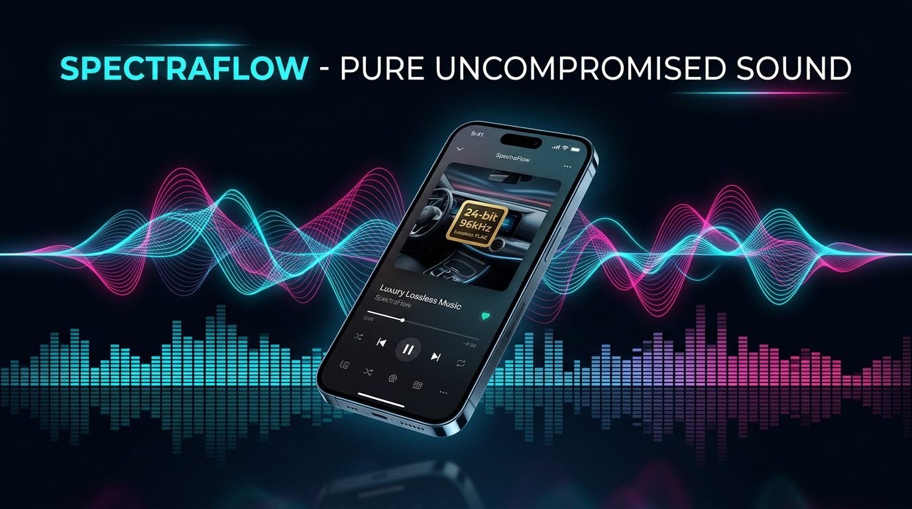

# 🌈 SpectraFlow — Studio Lossless & Bit-Perfect FLAC Player

  

---

### 🚀 About SpectraFlow

**SpectraFlow** is an advanced open-source audio streaming, offline vault, and studio DSP player built for audiophiles, lossless collectors, and sound lovers.

- 💎 **Bit-Perfect DAC Engine:** Direct hardware AudioTrack passthrough rendering unadulterated 24-bit / 96kHz and 192kHz FLAC, bypassing Android's 48kHz OS resamplers.
- 🚗 **Acoustic Car DSP Matrix:** Pre-calibrated cabin reflection curves (**Pioneer 7600 Space Expand**, **Alpine BassEngine Pro**, and **Clarion HX-D2**) designed to cut through vehicle road noise and off-axis door reflections.
- 🎭 **Dual-Persona Architecture:** 1-Tap **Classic Minimal** (clean, zero technical clutter, 1-tap presets, auto-normalization) vs. **Audiophile Studio** (10-band parametric EQ, Live Poweramp audio spec pill).
- ⚡ **Stream & Vault Pipeline:** Ultra-low latency lookahead buffering, LRCLIB synchronized lyrics, and lossless local storage indexing.

---

### 🌐 Official Interactive Launch Website
Experience the interactive 3D soundstage and audio spectrum at:  
👉 **[https://beerbro6.github.io/spectraflow-preview/](https://beerbro6.github.io/spectraflow-preview/)**

---

© 2026 SpectraFlow. Created by **Anmol Ratn** ([@BeerBro6](https://github.com/BeerBro6)).
